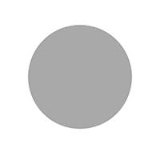
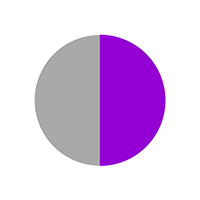
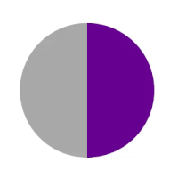
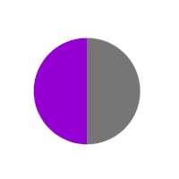
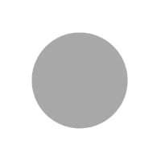
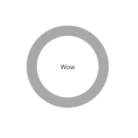

Today, we are going to build a circular progress bar with `Animated` library of react native with the help of *three semicircles*. Let's understand the concept first then we will dive into coding.

# Concept
We have a base outer circle which serves as a container for other three semicircles. We will rotate these semicircles with `transform` property to acheive desired result.



## How does three circles work?
Their working depends on the value of progress. It can either be less than or greater than 50. Let's see the two possible cases: 

## Case 1. If progress percentage < 50

### 1. First Circle
First circle (purple) is initialised with a rotation of 180 degrees and completely covers the right portion of the outer base circle (grey).  



### 2. Second Circle
Second circle is rendered on top of first circle (purple) with same rotation and backgroundColor equal to outer base circle (grey). It makes the first circle dissapear as grey color completely overshadows the inner purple circle. *I have reduced the opacity of upper (grey) circle to show what's happening*  

   

When user clicks to animate, we are rotating the upper (grey)circle which is slowly reveiling the inner (purple) circle from behind.  

  

Note: Inner circle (purple) is not moving at all. We are rotating the upper circle (semi transparent here) to show the inner circle from behind.  

### 3. Third Circle
Third semicircle is initialed with 0 degree rotation thus covers the left half of the base outer circle. It's background color is grey (same as base circle).  
Remember, second circle (grey on right) is moving clockwise and taking some of the left portion of the circle. It looks something like   
  
Hence, third (left grey) circle has higher elevation which enables it to overlap the extra portion of second circle on left side.  


## Case 1. If progress percentage > 50
Initially all three semicircles are initialed with 0 degree rotation and covers the left half of outer base circle (grey). First circle is at bottom then second on top it and third on top of second as it has highest elevation. This leave the right half of base circle empty.  

### 1. First Circle
Both first and second circle (both purple at left) will slowly rotate to cover the right half from 0 to 180 degrees together. This covers the animation till 50%.  

  

Now first circle stops and second circle takes over to complete the remaining rotation.

### 2. Second circle
First circle's job is to take upto 50% of progress and then the second circle will rotate some more to cover the remaining percentage.
I have made second circle semi-transparent to show you how it's actually working. (third circle is removed for simplicity)  



So 50% area covered by first circle and 20% area covered by second circle adds up to complete the animation. But wait, what about third one? It is still on top of second one and we can't see the second circle which is hidden. Let's see what our third circle is doing.

## 3. Third circle.
We will rotate third circle along with second for same degree clockwise. It will leave space so that second circle become visible. To show clearly, third circle is yellow right now and first & second are removed.  

   

You see the problem here? As our third circle rotate clockwise, it takes some portion of the right half and overlays the first circle (third has higher elevation, remember?).   
Solution is simple and you might have guessed it already. Toggle the elevation value so it the third circle goes inside the first circle.   
**First circle** is semi-transparent right now so you can see how third (yellow) circle is going behind the first circle (semitransparent). After toggling elevation:  

  

I hope it is clear what's happening. Let's correct the colors and see our final animation.  



Looks good, isn't it? Let's add a smaller inner circle so our view can start looking more like a progress bar. 

## Inner circle
A smaller inner circle goes on top of everything creating an appearance of progress bar.  



# Let's code

Step 1:
Render a container circle with a gray color background. It is our base, and it will contain the other three semicircles.
```javascript
<View
  style={[
    styles.outerCircle,
    {
      height: radius * 2,
      width: radius * 2,
      borderRadius: radius,
      backgroundColor: passiveColor,
    },
  ]}
/>
```

Step 2:
Render a semicircle, and it will take the right half of our base circle.
We are going to render three semicircles, so let's write a helper function to make our job easier.
```javascript
const renderHalf = (color, transforms = [], otherStyles = {}) => (
    <Animated.View
      style={[
        styles.half,
        { backgroundColor: color, borderColor: color },
        { width: radius, height: radius * 2, borderRadius: radius },
        {
          transform: [
            { translateX: radius / 2 },
            ...transforms,
            { translateX: -radius / 2 },
            { scale: 1.004 },
          ],
        },
        otherStyles,
      ]}
    >
    //children
    </Animated.View>
  );
```
It takes a color prop and a transform prop to rotate the circle clockwise. Let's not worry about the logic right now and call this function to render our first semicircle.
```js
{renderHalf(activeColor, [{ rotate: rotate1 }])}
```

rotation logic
```js
const rotate1 = animatedValue1.interpolate({
    inputRange: [0, 1],
    outputRange: ['0deg', '1deg'],
  });
```


Step 3:
Render another half circle on top of it. For clearity I am adding yellow color for now. 
```js
{renderHalf('yellow', [{ rotate: rotate2 }])}
```

Step 4:
Render another half circle and place it at left side

Step 5:
Render a smaller inner circle with background color
