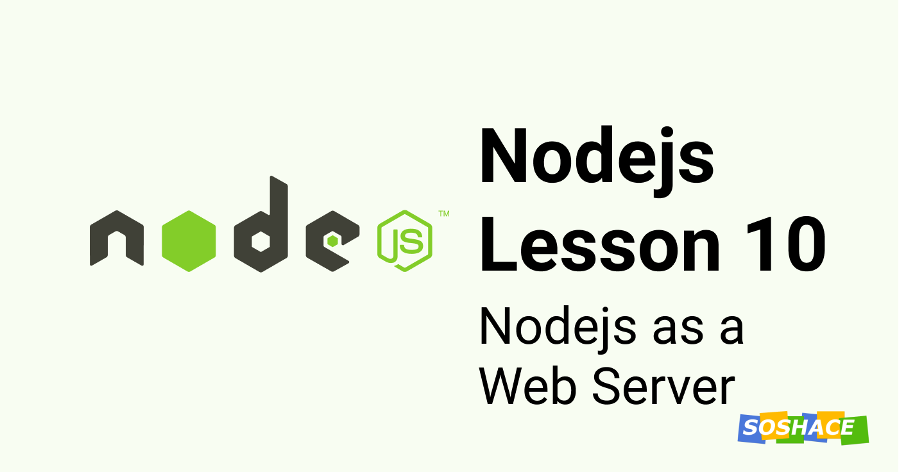

# Nodejs Lesson 10: Nodejs as a Web Server



Hey everyone, today we going to learn how to create a web server using http module. We will learn more about this module and use our knowledge about EventEmitter from the previous lesson. We will also see how to serve an HTML file from the webserver we created. Let's start.

## What is a Web Server

A Web Server is an HTTP server whose job is to accept HTTP requests and return a response. It's a piece of backend code running on a machine somewhere that serves our request. Whenever we type a URL in the address bar and request a web page, there is a web server who takes our request and returns the appropriate webpage. The files that we need to visit the webpage are hosted or stored on a web server and it understands the URLs very well. It reads the requested URL, checks which file needs to be accessed, and returns that file as a response.

In this way, the main task of the webserver is to store the webpages, process, and deliver them as they are requested. This response can either be an HTML file for web pages or a JSON output for an API. To be honest, we can't imagine the internet without web servers. Sounds interesting right? Let's create one ourselves.

## How to Create a Web Server

Now that we understand the job of a web server, it will be much easier for you to follow along. We will use our good old `http` module to create a web server. Let's follow the process one step at a time.

### Step 1: Set up a project directory

This is a new app so let's set it up in a fresh directory. We will name the directory `web_server`. Once you're done, enter the folder and create a file `server.js`. We will add all our code in this file.

### Step 2: Create a server and listen to a port

Let's import the `http` module first. http module has a method `createServer()` which is used to instantiate server. After that, we will listen to incoming requests on a particular post.

```js
const http = require('http');
const port = 1337;
const host = 'localhost';

const server = http.createServer(function (req, res) {
    // add code to handle requests
});

server.listen(port, host, function () {
    console.log('Web server is running on port 1337');
});
```

`server.listen()` starts listening to incoming requests on port number and host passed in the first and second arguments. The third argument is a callback that gets called once the server starts listening. We are logging a message so that we know that the server setup is completed successfully.

Did you notice the arguments received by callback in the `createServer()` method? Let's talk about what are those.

The first argument `req` is the request object. It contains information about the request. It will answer questions like what type of request is this? Is there any data passed along with it? What are query parameters? etc.

The second argument `res` is the response object. We will use it to return a response when the request is successful or return an error in case of failure. We will also set the HTTP response status on this object to better explain the type of response. 404 is "file not found" error, 500 is "server error" and 200 status code is for the successful requests. Of course, there are many more, you can check the whole list on [this link](https://en.wikipedia.org/wiki/List_of_HTTP_status_codes).

### Step 3: Handle Incoming Requests

There are few methods attached with `req` and `res` objects. We can use those to perform different operations. Let's see how:

```js
const http = require('http');
const port = 1337;
const host = 'localhost';

const server = http.createServer(function (req, res) {
    const url = req.url;
    if (url === '/text'){
        res.end("Hello from Server");
    }
});

server.listen(port, host, function () {
    console.log('Web server is running on port 1337');
});
```

Here, we are checking for url from the request object and if its value is "text", we will return a string response using `res.end()`. But the plain text is not the only format we can use to send a response. HTML, JSON, and CSV formats can also be sent similarly. We just need to tell our response object about what type of data we are sending. We can do that using headers on the response.

```js
const http = require('http');
const port = 1337;
const host = 'localhost';

const server = http.createServer(function (req, res) {
    const url = req.url;
    if (url === '/text'){
        res.end("Hello from Server");
        return;
    }

    if (url === '/json'){
        res.setHeader("Content-Type", "application/json");
        res.writeHead(200);
        res.end(`{"message": "Hello from Server"}`);
        return;
    }

    if (url === '/html') {
        res.setHeader("Content-Type", "text/html");
        res.writeHead(200);
        res.end(`<html><body><h1>Hello from Server</h1></body></html>`);
        return;
    }

    if (url === '/csv'){
        res.setHeader("Content-Type", "text/csv");
        res.writeHead(200);
        res.end(`name,email\n1,John Doe,john@example.com`);
        return;
    }
});

server.listen(port, host, function () {
    console.log('Web server is running on port 1337');
});

```

We are using multiple if block to determine which type of response to send. Then we set headers using the `setHeader` method. This info is needed to parse the response. We set the status code using the `writeHead` method and return the response with `end()`.

We can use this method to serve API requests using JSON or serve webpages using HTML. Also, do notice the `req.url` in the above code. We are returning different responses for different URLs. This is how routing works. You can check for which route the request is coming from and handle the response accordingly. Feel free to use switch case here when the number of routes increases. I hope you get a good idea of how the web server works now.

So far, we have learned what a web server works are and how they work. We also created our web server with routing and the ability to serve multiple formats. That's it for today's lesson. Let me know if this was helpful in the comments below.