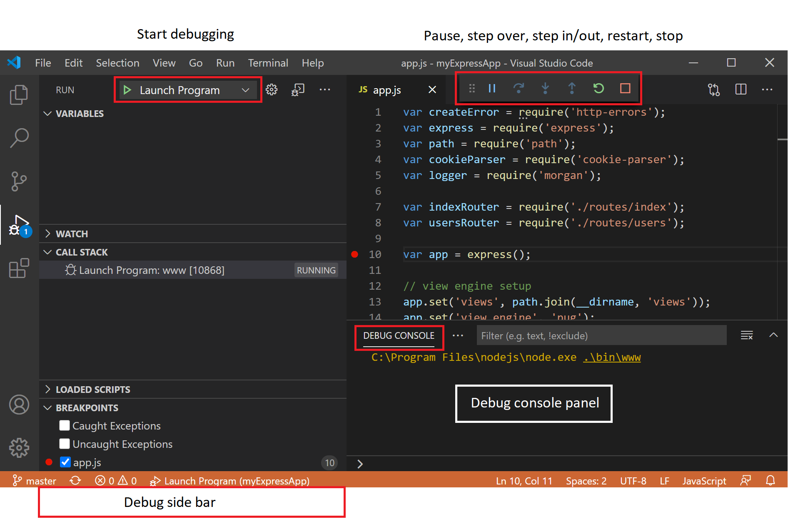

# Nodejs Lesson 13: Nodejs Debugging

Hey everyone. Debugging is an essential part of programming, our program hardly runs correctly in the first run and we spend most of our time figuring out what's wrong with our code. To quote **Maurice Wilkes** here:

> *"As soon as we started programming, we found to our surprise that it wasn't as easy to get programs right as we had thought. Debugging had to be discovered. I can remember the exact instant when I realized that a large part of my life from then on was going to be spent in finding mistakes in my own programs."*– Maurice Wilkes

Since debugging is this important, it's almost an skill that we must learn to be a better programmer and ship features quickly. In this lesson, we will learn about debugging a node application. We will learn about different ways which can be employed to debug node application with ease. Here's a list of things we will cover in this article:

- JavaScript Debugger
- Chrome DevTools
- --inspect command
- --inspect-brk command
- IDE

Let's start 🚀

## JavaScript Debugger

Node has a built-in debugger which can be accessed by adding a `debugger` statement in the code itself. Nodejs will pause the execution of the process when it encounters this statement. We will then go ahead and inspect the app state at that particular point in time to see what is causing the issue. Let's consider this example:

```js
const url = require('url');
 
const server = http.createServer();
 
server.on('request', function(req, res) {
    const urlParsed = url.parse(req.url, true);
 
    if (req.method == 'GET' && urlParsed.pathname == '/echo' && urlParsed.query.message) {
        res.end(urlParsed.query.message );
        return;
    }
 
    res.statusCode = 404;
    res.end('Not Found');
});
 
server.listen(1337);
console.log("Server is running");
```

It's a basic echo server that is not functioning well. We can add a `debugger` statement and stop the process.

```js
const url = require('url');
 
const server = http.createServer();
 
server.on('request', function(req, res) {
    const urlParsed = url.parse(req.url, true);
    debugger; // <-- Debugger added
    if (req.method == 'GET' && urlParsed.pathname == '/echo' && urlParsed.query.message) {
        res.end(urlParsed.query.message );
        return;
    }
 
    res.statusCode = 404;
    res.end('Not Found');
});
 
server.listen(1337);
console.log("Server is running");
```

Now, you can run the script and it will add a breakpoint exactly where we added the debugger statement. Run this command to launch the script:

```sh
node debug script.js
```

You can see the required info like variable value, function scope, etc in the console. The debugging mode provides us other helpful commands like `cont` which we can use to continue the execution of the program.

## Chrome DevTools

While the above strategy works well, but it still needs some extra work on our end. There is a much better alternative in the form of Chrome DevTools. Since Chrome is the most widely used web browser among the developer, it equips us with some really useful features.

You can open chrome and run your program. Right-click and go to inspect to open the Chrome DevTools. Here is what you can do with it:

- Search the codebase
- Use the `debugger` statement explained in the first section right in the DevTools itself.
- Edit `HTML` and `CSS` to debug frontend code.
- Clear cookies and cache
- Throttle network speed to test on a slow connection.
- Check network requests.
- Monitor Performance using Profiler.

## --inspect command

You can start your node application with --inspect command and a Node.js process will start listening for a debugging client. By default, it will listen to the host and port 127.0.0.1:9229. Once started, programs like Chrome DevTools, Microsoft Edge and VS Code, WebStorm, Eclipse, etc can be connected to the debugger process to inspect further. Example:

```sh
node --inspect server.js
```

## --inspect-brk command

The strategies mentioned above are good as long as we can run the program. But what if the program itself starts crashing. This is likely to happen in the case of an undefined variable or an unknown function call. Consider this example:

```js
server.on('request', function(req, res) {
    var urlParsed = url.parse(req.url, true);
 
    randomFunction(); // this function doesn't exist
 
    if (req.method == 'GET' && urlParsed.pathname == '/echo' && urlParsed.query.message) {
        res.end(urlParsed.query.message );
        return;
    }
 
    res.statusCode = 404;
    res.end('Not Found');
});
```

In the above code, the function `randomFunction()` doesn't exist and will cause the program to crash. We can't use the debugger statement since we need the program to run first so that we can pause later and inspect.

You can start your node application with the `--inspect-brk` command and it will add a breakpoint before the user code starts. This strategy helps understand the cause in the scenario mentioned above.

## IDE

Moderns IDEs like VS Code and WebStorm come with an inbuilt debugger which can be used to find the error in our souse code. While the process is almost the same in all the IDEs, they slightly differ in terms of GUI. We will talk about VS Code here.

VS Code has a debugger tab on the left sidebar, you can this to access the debugging window. You will see a button to **Launch Program** with a bunch of options to pause, reload, stop, go back, go forward buttons on the top right corner. This command helps us time travel in the nodejs execution and find the cause of the error. There is also a **DEBUG CONSOLE** where you can see the relevant information about the process.



These are all the methods you can employ for your debugging process. Feel free to choose according to the task and your preference.
