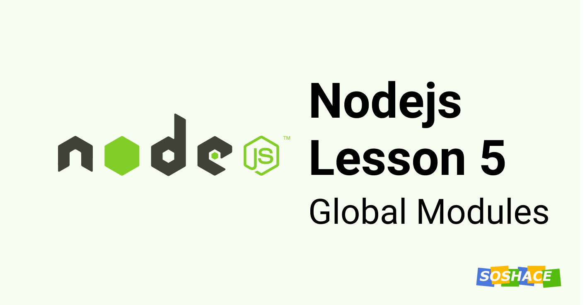

# Node Lesson 5: Global Modules



Hello everyone, we will learn about **global modules** in this lesson. We will talk about what are they, how they work, and why we need them. Let's start.

## What are global modules

Global modules are node packages that are installed on your system rather than your project directory. They allow us to use the package as a tool anywhere on the local computer.

By saying **global**, we are talking about the **scope of usage** of these modules. Generally, modules are scoped inside the project directory only, it means you can't use them outside the project. But as global modules are installed on the computer (mostly root location), **they can easily be used anywhere in our system**. This property of node modules can come very handy in certain situations. We will talk about those situations later in this article.

## How to install a module globally

To make a certain package available *globally*, we will use the below command:

```sh
npm install -g <package-name>
```

This `-g` will make sure the package is installed in the system directory and thus it's available globally. The installation of **global module** is a little different from the normal one. Let's see how.

## Where do they get installed

Global modules are installed in the standard system directory `/usr/local/lib/node_modules` unlike generic installation which installs the module in the project directory.  

If you want to know what's the root location of the global module installation, you can do so by typing this command:

```sh
npm root -g
```

This will print the location on your system where all the global modules are installed. So now we know how to install them and where they get installed. Let's talk about why we need them.

## Why we need global modules

Globally means publicly available here. There are few things that we might need to do but we certainly don't need those package inside our project. An example could a cli tool to create a project or a tool to format the code or it can be a cli tool to generate a file.

Remember when we typed `npm init` and it generated a `packages.json` for us. That's a classic example of how we might use a globally available module. Some other examples could be [create-react-app](https://github.com/facebook/create-react-app#readme) to create a react project, [react-native-cli](https://github.com/react-native-community/cli/tree/master/packages/global-cli) to create a react native  project, and [readme-md-generator](https://github.com/kefranabg/readme-md-generator) to generate a `README.md` file for your project.

Consider these global modules as tools for your development. It makes our job easier.

## How to check which packages are installed globally

To know the packages installed on your computer, simply type this command in the terminal:

```sh
npm list -g
```

It will give you the list of packages that are available globally.

That's it for this lesson. We learned a lot of cool stuff about global modules. In the next lesson, we will talk about some most frequently used node modules and learn how to use them. Stay tuned for the next article.
